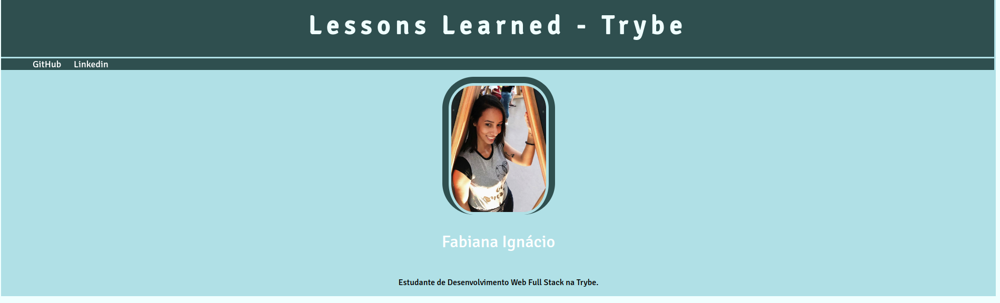
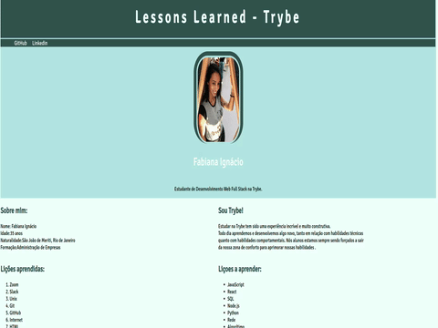

#  Projeto Lições Aprendidas! 📚  

## :memo: Descrição

Projeto Lições Aprendidas.

 
## :books: Funcionalidades
* <b>Funcionalidade </b>: Projeto Lições Aprendidas é um site que contem informações sobre o meu aprendizado como estudando na Trybe. Foi o primeiro projeto como estudante de desenvolvimento web e teve como objetivo proposto iniciar a prática com a estrutura de html semântico.

    

 

## :wrench: Tecnologias utilizadas
* HTML;
* CSS;

## :soon: Implementação futura
* tornar a aplicação responsiva

